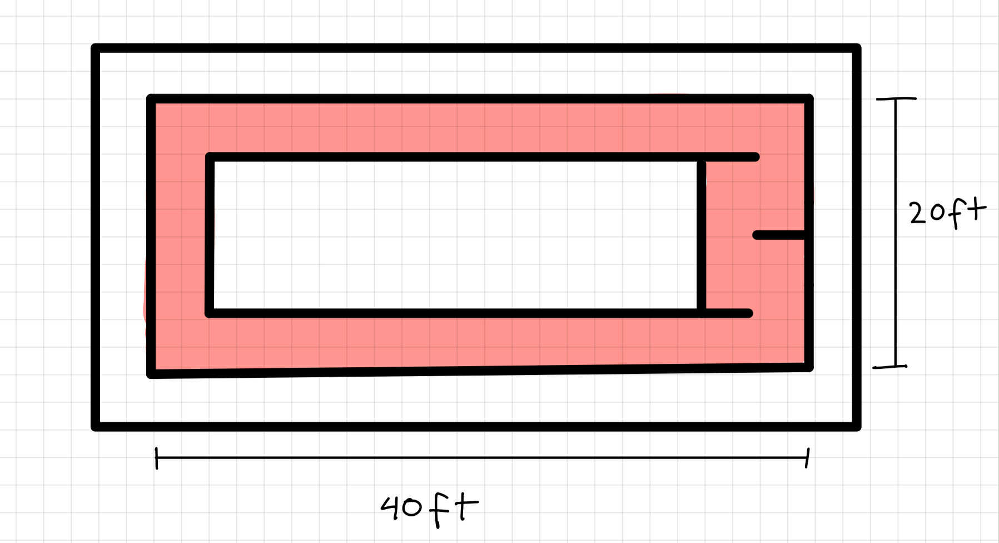

## Benchmark done on 2/4/2026

Stack used:

- Cartographer for mapping
- AMCL for localization
- Global trajectory raceline
- Pure pursuit controller

**Goals for this benchmark:**

1. Assess the top speeds of the current stack
2. Assess performance with hairpins and tight turns
3. Log max speeds

Figure 1: benchmark mock racetrack

**Observations:**

**Speed**

Speed was capped at 2 m/s. Speeds above this would cause the localization to lag and the vehicle would race into the barriers.
Fix options:
1. Swap localization algorithm (cartographer integration is currently in the works)
2. Check latency of AMCL. This algorithm is said to perform well even with high speeds, look into why that isn’t the case here

[AMCL benchmark video](https://www.youtube.com/watch?v=OTsvAsLGffM)

**Trajectory**

Global trajectory does not take into account the width of the vehicle.
Fix options:
1. Re-do the global trajectory and ensure the raceline passes through the middle of the track/account for vehicle width
2. Find another global trajectory generator

Vehicle only runs counter clockwise
Fix options:
1. check configs if there is a setting for this

[Linked Curve benchmark video](https://youtu.be/gVhkMk-92a8)
